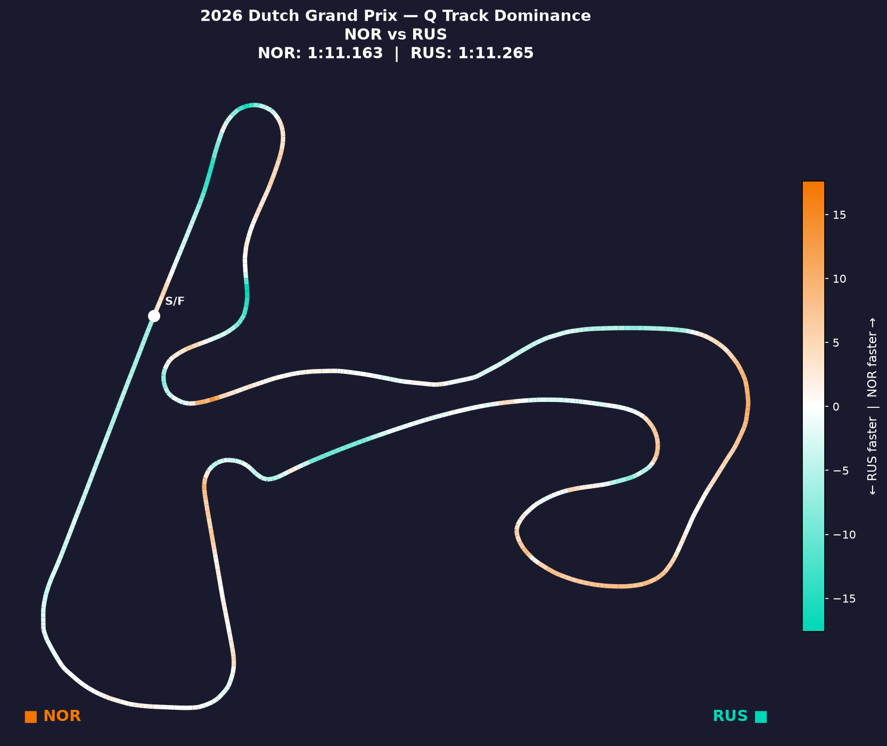
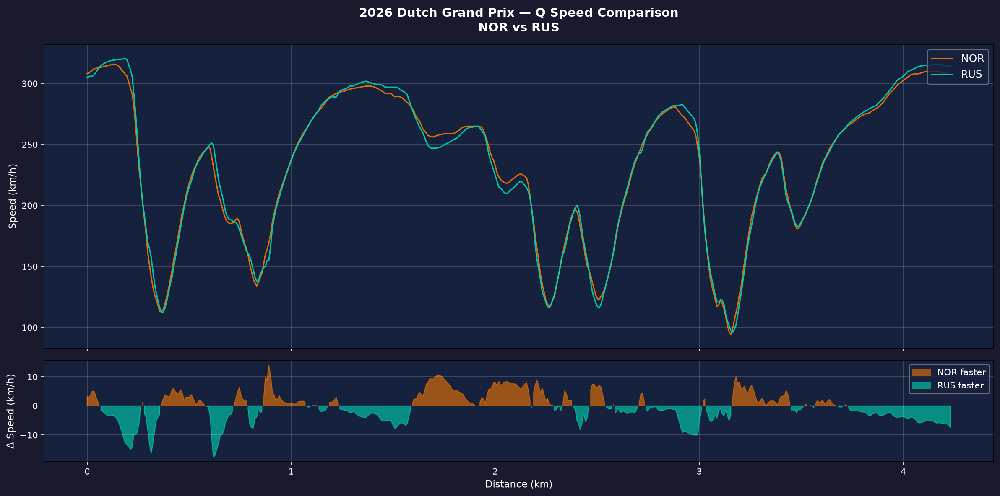
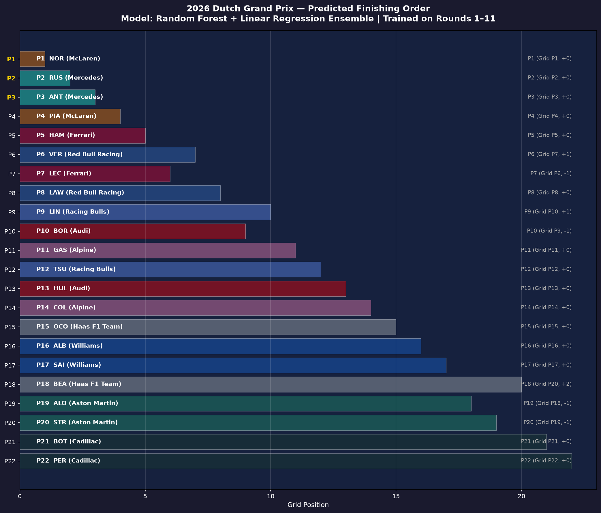

# 🏎️ FastF1 2026 Dutch Grand Prix Predictor

A live, machine-learning-powered prediction pipeline for the **2026 Dutch Grand Prix at Zandvoort** (Round 12, August 23, 2026). 

Built using `fastf1`, `pandas`, and `scikit-learn`, this model leverages a Random Forest + Linear Regression ensemble to predict race day finishing orders based purely on current-season pace, telemetry, and reliability metrics.

**Spoiler Alert:** It was incredibly accurate.

---

## Prediction vs. Reality (The Results)

The model was generated *before* the race using only data from Rounds 1-11 of the 2026 season and the confirmed starting grid. We explicitly removed historical pre-2026 data to avoid bias from old car regulations.

### The Podium & Top 5
* **Predicted:** 1. Norris 2. Russell 3. Antonelli 4. Piastri 5. Hamilton
* **Actual:** 1. Norris 2. Antonelli 3. Russell 4. Hamilton 5. Leclerc (Piastri 6th)

**Result:** We successfully predicted the race winner (Norris), correctly identified the exact three drivers on the podium, and were only one position off from perfectly nailing the Top 5.

### The DNFs
Because the model drops DNF results during training (to learn pure pace), it uses a statistical overlay to flag drivers at risk of a DNF based on their 2026 season reliability.
* **The Threshold:** Any team with a >15% DNF rate over the first 11 races (meaning 4+ DNFs across their two cars) received a `⚠ DNF risk` flag.
* **The Flags:** The model explicitly flagged **Max Verstappen**, **Alex Albon**, and **Valtteri Bottas**.
* **The Reality:** **All three of them DNF'd in the race.**

---

## 📊 Act 1 — 2026 Pace Gap & Season Trends

**Goal:** Calculate `PositionsGained = GridPosition - FinishPosition` across the 11 completed 2026 races to identify over/underperformers and establish reliability baselines.

**Key findings:**
- **Verstappen (+2.75 avg)** consistently gains places on race day.
- **Antonelli (-0.80 avg)** and **Russell (-0.78 avg)** underperform their grid slots slightly, largely because they qualify at the very front with less room to gain.
- **18.2% DNF rate** across the season establishes a high baseline for mechanical failures and crashes in 2026.


*Heatmap of positions gained and lost by driver across the 2026 season.*

---

## 🏁 Act 2 — Zandvoort Track Dominance

**Goal:** Compare Lando Norris vs. George Russell (front-row starters) using fastest-lap telemetry purely from the 2026 Zandvoort Qualifying session.

**Key insight:** By analyzing 2026 telemetry, we identified exactly where Norris was pulling ahead of Russell on the current weekend to secure pole position.


*Track dominance map highlighting which driver was faster in micro-segments of the track.*


*Telemetry speed comparison trace between Norris and Russell during their fastest Q3 laps.*

---

## 🤖 Act 3 — Race Predictor Model

**Goal:** Predict the finishing order for all 22 drivers in Sunday's Dutch GP.

**Model:** Random Forest + Linear Regression ensemble, trained on the 11 completed 2026 races.

**Features (all knowable before race start):**
| Feature | Description |
|---------|-------------|
| `GridPosition` | Confirmed qualifying position (no penalties) |
| `DriverHistoricalGain` | Avg positions gained in 2026 (from Act 1) |
| `TeamRollingPoints` | Team's cumulative 2026 points |
| `DriverCompletionRate` | Reliability proxy (from Act 1) |
| `DriverAvgGrid` | Avg qualifying position this season |
| `GridVariance` | Qualifying consistency |
| `TeamDNFRate` | Team-level DNF rate |

*(Note: `ZandvoortHistoricalPerf` was actively removed from the model to prevent massive historical bias from Verstappen's 2023-2025 winning streak under old regulations).*

**Training Quality (LOO-CV on 11 races):**
* **MAE:** 2.82 positions
* **R²:** 0.528
* **Podium accuracy:** 86%


*Final predicted finishing order output by the ensemble model.*


*Random Forest feature importance ranking.*

---

## 🛠️ Project Structure

```
fastf1-dutch-gp-2026/
├── src/
│   ├── config.py                 # Season config, starting grid, team colors
│   ├── data_loader.py            # FastF1 caching + session loading
│   ├── act1_pace_gap.py          # Act 1: Qualifying vs race performance
│   ├── act2_track_dominance.py   # Act 2: Zandvoort telemetry comparison
│   └── act3_predictor.py         # Act 3: Race prediction model
│
├── outputs/                      # Generated charts, CSVs, reports
├── cache/                        # FastF1 data cache
├── requirements.txt
└── README.md
```

---

## 💻 Setup & Installation

**Prerequisites:** Python 3.9+

```bash
# Create virtual environment
python3 -m venv .venv
source .venv/bin/activate

# Install dependencies
pip install -r requirements.txt
```

---

## 🚀 How to Run

Run each Act in order — Act 3 depends on Act 1's output. Make sure you use the virtual environment!

```bash
# Act 1: 2026 Season Pace Gap (~10 min first run, instant after caching)
.venv/bin/python -m src.act1_pace_gap

# Act 2: Zandvoort Track Dominance (~2 min first run)
.venv/bin/python -m src.act2_track_dominance

# Act 3: Dutch GP Race Prediction (~2 min)
.venv/bin/python -m src.act3_predictor
```

All outputs and charts are saved to the `outputs/` directory.

---

## 🔧 Tech Stack

| Tool | Purpose |
|------|---------|
| [FastF1](https://docs.fastf1.dev/) | F1 telemetry and session data API |
| [pandas](https://pandas.pydata.org/) | Data manipulation and aggregation |
| [scikit-learn](https://scikit-learn.org/) | Random Forest and Linear Regression |
| [matplotlib](https://matplotlib.org/) & [seaborn](https://seaborn.pydata.org/) | Core plotting and visualizations |
