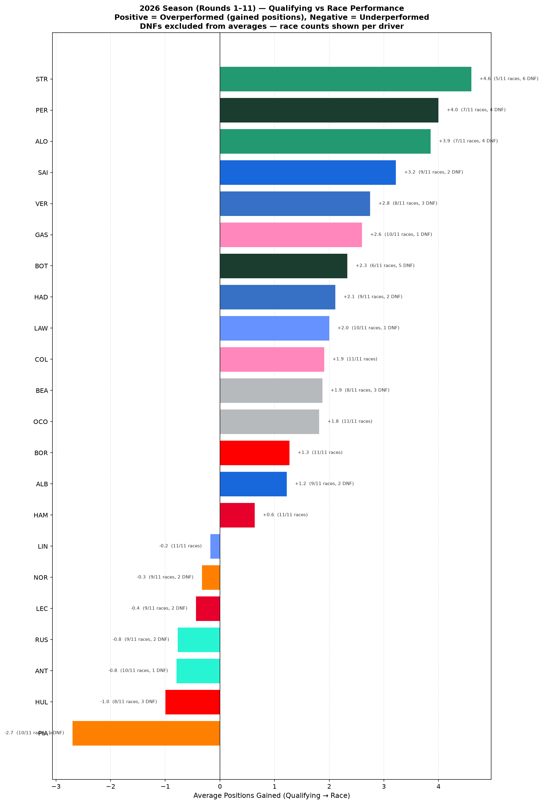
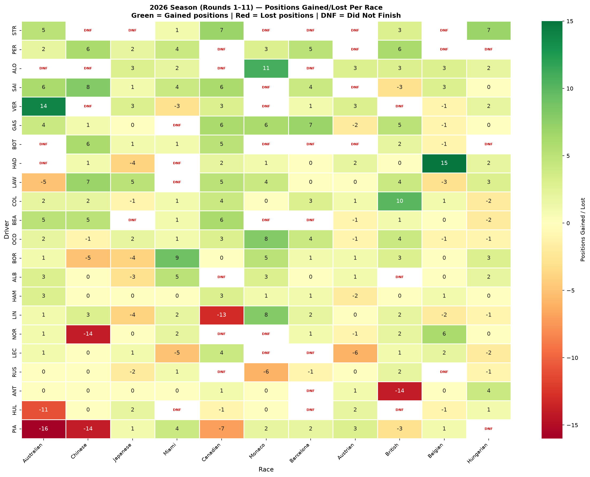
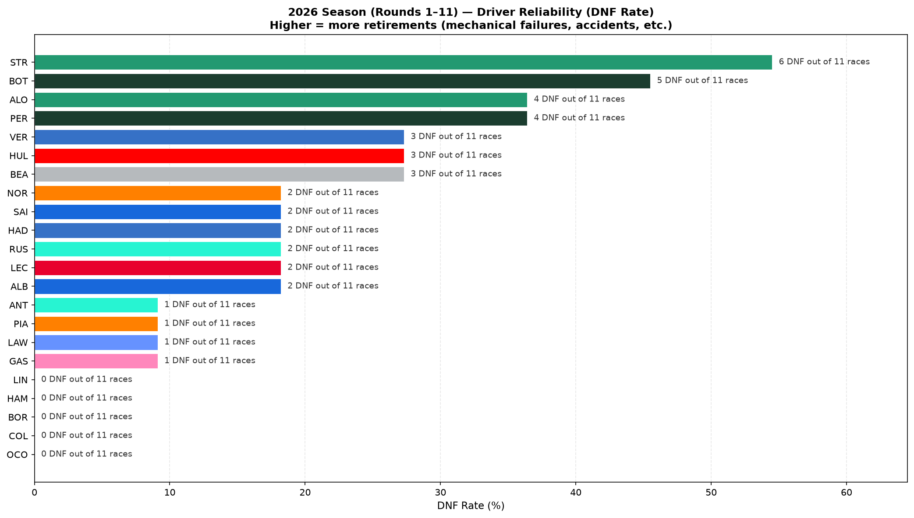
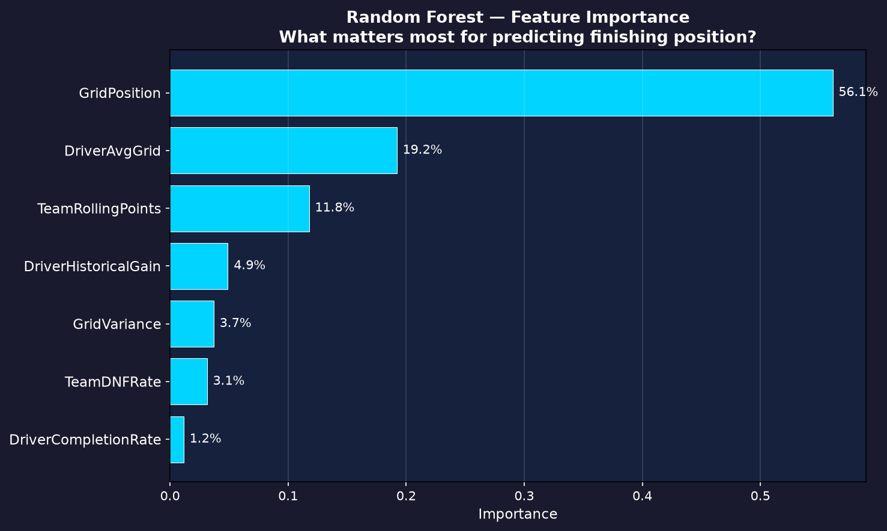

# 🏎️ FastF1 2023 Season Analysis

A 3-part Formula 1 data analysis project built in Python using the [FastF1](https://docs.fastf1.dev/) API. We analyze the entire **2023 F1 Season** — from qualifying-to-race pace gaps, to telemetry-level track dominance, to a machine learning model that predicts race finishing positions.

---

## Table of Contents

- [Overview](#overview)
- [Part 1 — Qualifying vs Race Pace Gap](#part-1--qualifying-vs-race-pace-gap)
- [Part 2 — Track Dominance Map](#part-2--track-dominance-map)
- [Part 3 — Race Outcome Predictor](#part-3--race-outcome-predictor)
- [Project Structure](#project-structure)
- [Setup & Installation](#setup--installation)
- [How to Run](#how-to-run)
- [Notes & Caveats](#notes--caveats)
- [Tech Stack](#tech-stack)

---

## Overview

The 2023 season was Max Verstappen's dominant championship run — but how did every driver *actually* perform relative to expectations? This project answers that question across three connected analyses:

| Part | Question | Method |
|------|----------|--------|
| **Part 1** | Who overperforms/underperforms on race day? | Grid vs finish position across 22 races |
| **Part 2** | *Where* on track is one driver faster? | Telemetry comparison with color-coded track map |
| **Part 3** | Can we predict race results from pre-race data? | Random Forest + Linear Regression on engineered features |

Each part feeds into the next — Part 1 identifies interesting drivers, Part 2 zooms into their telemetry, and Part 3 uses Part 1's data to build a predictive model.

---

## Part 1 — Qualifying vs Race Pace Gap

**Goal:** For every driver, calculate `PositionsGained = GridPosition - FinishPosition` across the full season to find who consistently gains or loses places on Sunday.

**Key decisions:**
- DNFs are **excluded** from pace gap averages but tracked as a first-class reliability metric. DNFs are too noisy to include — they can be caused by the driver, other drivers, or mechanical failures.
- Charts annotate how many races each average is based on, so small-sample effects are visible.
- Only main Sunday races (no sprints), so grid position = qualifying position.

### Sample Outputs

**Average Positions Gained (Season Overview)**



**Positions Gained/Lost Heatmap (Driver × Race)**



**DNF Reliability Chart**



### Key Findings
- **Pérez (+5.2 avg)** — Biggest race-day overperformer. Consistently fought forward from mid-grid qualifying.
- **Verstappen (+2.1 avg, 0 DNFs)** — Overperformed *and* was the only driver with 22/22 completion. Perfect reliability.
- **Hülkenberg (-1.3 avg)** — Biggest underperformer. Haas qualified better than they raced.
- **Stroll (+3.6 avg)** — Strong race pace but only 17/22 races (5 DNFs). Noisy, small sample.

---

## Part 2 — Track Dominance Map

**Goal:** Take two drivers from Part 1 (Pérez vs Verstappen) and compare their fastest lap telemetry at a specific session. Visualize *which parts of the track* each driver was faster through.

**Approach:**
1. Load a qualifying session and extract each driver's fastest lap telemetry
2. Interpolate both speed traces onto a shared distance axis (500 points)
3. Compute speed delta at each point (positive = Driver 1 faster)
4. Color-code the track map using a `LineCollection` with a custom diverging colormap

**Session used:** Bahrain Grand Prix Qualifying (PER vs VER)
> Australia was originally planned but Pérez crashed in Q1 — no valid fastest lap available.

### Sample Outputs

**Track Dominance Map**


**Speed Comparison Trace**


### Key Findings
- **VER 1:29.708** vs **PER 1:29.846** — only 0.138s apart
- VER dominated **55%** of track segments, PER **45%**
- PER's edge: **+33.8 km/h** advantage in braking zones (later braking points)
- VER's edge: **-27.0 km/h** advantage in traction zones (better corner exit speed)

---

## Part 3 — Race Outcome Predictor

**Goal:** Build a machine learning model to predict finishing positions using only pre-race data (qualifying pace, historical performance, team strength).

**Design decisions:**
- **Regression, not classification.** Predicting continuous position (1–20) gives more granularity than binary podium/no-podium, especially with only ~440 samples.
- **Chronological train/test split.** Train on rounds 1–16, test on rounds 17–22. No shuffling, no cross-validation — this is a time-series task.
- **DNFs excluded from training.** We can't meaningfully predict "DNF" as a position — it would only add noise.

**Features (all knowable before race start):**

| Feature | Description |
|---------|-------------|
| `GridPosition` | Qualifying position for this race |
| `DriverHistoricalGain` | Driver's avg positions gained in *prior* races |
| `TeamRollingPoints` | Team's cumulative points *before* this race |
| `DriverCompletionRate` | % of prior races the driver finished |
| `DriverAvgGrid` | Driver's average qualifying position so far |
| `GridVariance` | How consistent the driver's qualifying has been |

### Model Comparison

| Model | MAE | RMSE | R² | Within ±3 | Podium Acc |
|-------|-----|------|----|-----------|------------|
| Naive (Grid=Finish) | 4.18 | 5.52 | -0.30 | 49% | 86% |
| **Linear Regression** | **2.56** | **3.46** | **0.49** | **65%** | **89%** |
| Random Forest | 2.67 | 3.63 | 0.44 | 63% | 89% |

### Sample Outputs

**Predicted vs Actual (All Models)**


**Feature Importance (Random Forest)**



**Predicted vs Actual Championship Standings**


### Key Findings
- **Linear Regression slightly outperforms Random Forest** — with only 65 test samples, the simpler model generalizes better.
- **36% improvement** over the naive baseline. Historical features add real predictive value.
- **DriverAvgGrid is the strongest predictor** (58.9% importance) — where a driver *typically* qualifies captures both car performance and driver ability.
- **65% of predictions are within ±3 positions** of actual.

### Honest Limitations
The model captures ~70–80% of outcomes driven by pace and team quality. The remaining ~20–30% is the chaos that makes F1 exciting — first-lap incidents, safety car timing, weather, in-season upgrades, and strategy gambles.

---

## Project Structure

```
FastF1-2023-Analysis/
├── src/
│   ├── __init__.py
│   ├── config.py                # Paths, constants, season config
│   ├── data_loader.py           # FastF1 caching + session loading
│   ├── act1_pace_gap.py         # Part 1: Qualifying vs race pace
│   ├── act2_dominance_map.py    # Part 2: Track dominance visualization
│   ├── act3_predictor.py        # Part 3: ML prediction pipeline
│   └── act3_championship.py     # Bonus: Championship standings comparison
│
├── outputs/                     # All generated charts and data
│   ├── act1_*.png / .csv        # Part 1 outputs
│   ├── act2_*.png               # Part 2 outputs
│   └── act3_*.png / .csv / .txt # Part 3 outputs
│
├── cache/                       # FastF1 data cache (~1.5 GB, gitignored)
├── notebooks/                   # Jupyter notebooks (optional exploration)
├── requirements.txt
├── .gitignore
└── README.md
```

---

## Setup & Installation

**Prerequisites:** Python 3.9+

```bash
# Clone the repository
git clone https://github.com/<your-username>/fastf1-2023-analysis.git
cd fastf1-2023-analysis

# Create a virtual environment
python -m venv .venv
source .venv/bin/activate   # macOS/Linux
# .venv\Scripts\activate    # Windows

# Install dependencies
pip install -r requirements.txt
```

---

## How to Run

Each part is a standalone script. **Run them in order** — Part 3 depends on Part 1's output CSV.

```bash
# Part 1: Qualifying vs Race Pace Gap (~30 min first run, instant after caching)
python -m src.act1_pace_gap

# Part 2: Track Dominance Map (~1 min first run)
python -m src.act2_dominance_map

# Part 3: Race Outcome Predictor (instant — reads Part 1's CSV)
python -m src.act3_predictor

# Bonus: Championship Standings Comparison
python -m src.act3_championship
```

All output charts and data files are saved to `outputs/`.

---

## Notes & Caveats

- **First run downloads ~1.5 GB** of timing data from the FastF1 API. This is cached locally in `cache/` for instant subsequent runs.
- **The 2023 season** was chosen because it's a complete season with rich storylines and fully available data.
- **DNF handling:** DNFs are excluded from pace gap averages but surfaced as their own reliability metric. Every chart annotates sample sizes so noisy averages are visible.
- **Sprint races excluded** — only main Sunday races are analyzed so that grid position = qualifying position.

---

## Tech Stack

| Tool | Purpose |
|------|---------|
| [FastF1](https://docs.fastf1.dev/) | F1 telemetry and session data API |
| [pandas](https://pandas.pydata.org/) | Data manipulation and aggregation |
| [matplotlib](https://matplotlib.org/) | Core plotting (including `LineCollection` for track maps) |
| [seaborn](https://seaborn.pydata.org/) | Heatmap visualization |
| [scikit-learn](https://scikit-learn.org/) | Random Forest and Linear Regression models |
| [NumPy](https://numpy.org/) | Numerical operations and interpolation |
| [SciPy](https://scipy.org/) | Scientific computing utilities |
